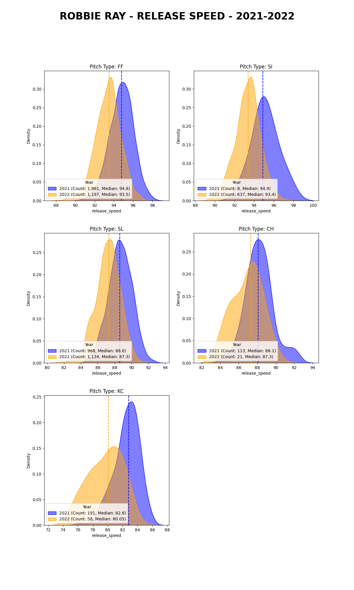
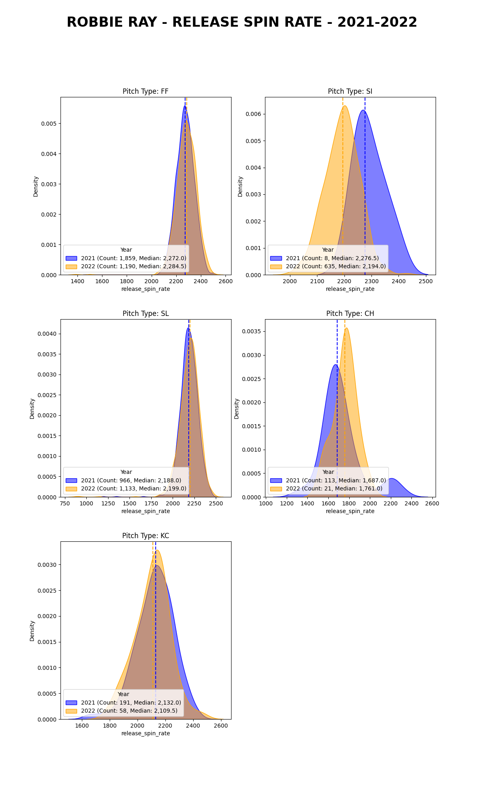
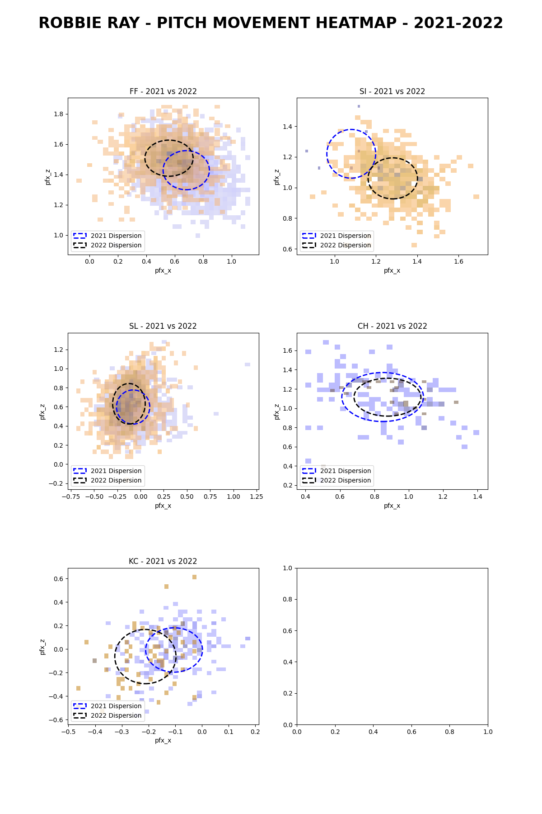
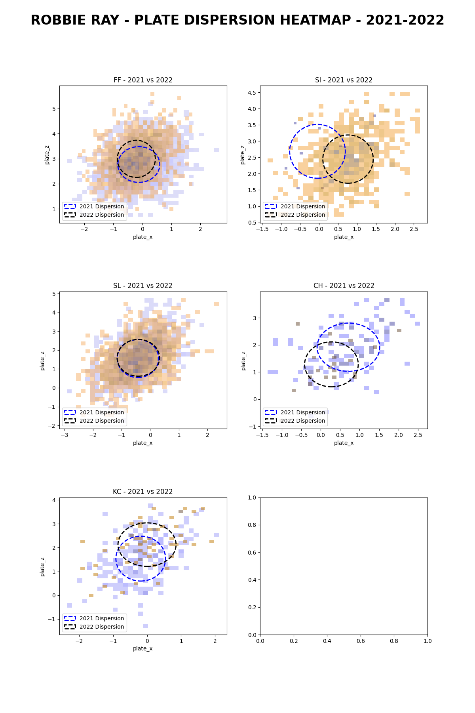
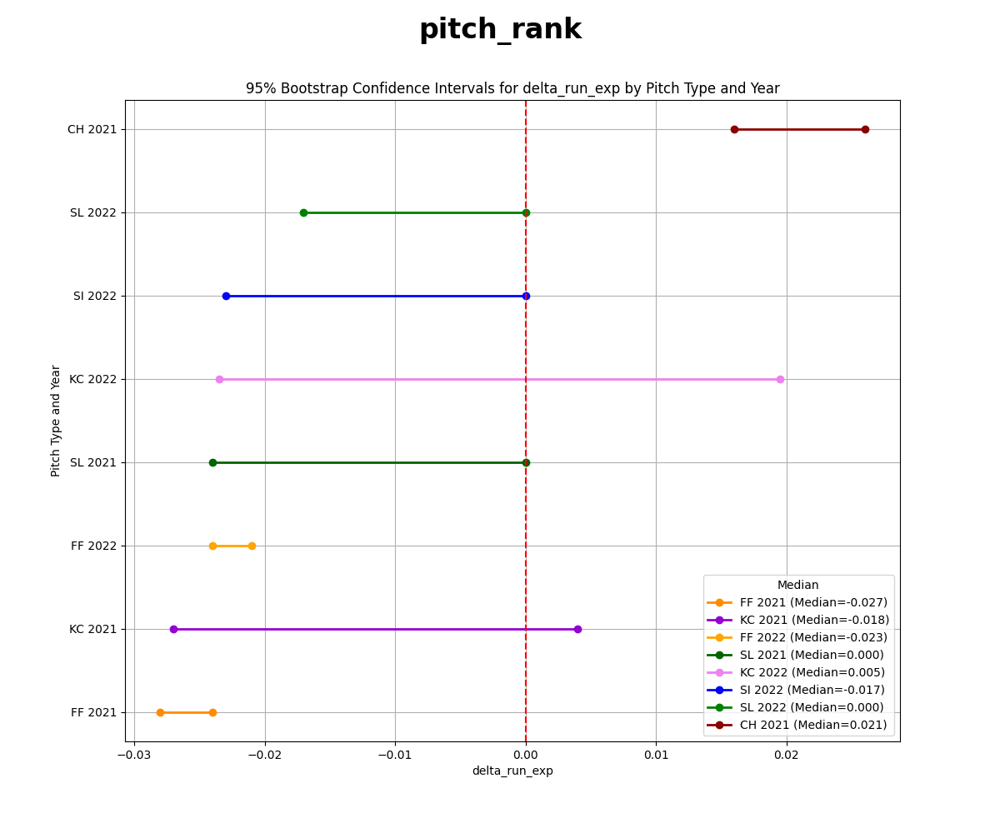

FULL REPORT
= 
## Notes
- Assumes regular season pitches only
- Assumes pitch must have a pitch type (no unclassified pitches)
- Assumes ad-hoc analysis (i.e. little consideration for code quality)
- Code: https://github.com/brntsllvn/interview/blob/main/src/afterhours/main.py

Questions
-
## (1) How have each of Ray’s pitches' ball flight metrics (velocity, spin, movement, etc.), location thrown, and usage has changed over the last 2 years (2021 - 2022) with 3-4 visualizations and/or tables.

    2022 vs. 2021 summary:
    - Usage: About the same total number of pitches Y/Y, but introduced new pitch sinker and largely abandoned changeup and knucklecurve 
    - Velocity: Median decrease of ~1 MPH across his entire arsenal (~2 MPH for KC)
    - Spin: Essentially unchanged (ignoring the change in new pitch sinker)
    - Movement: Four-seam fastball is breaking a little less vertically and horizontally. KC is breaking more horizontally (and a little vertically)
    - Location thrown: Four-seam fastball and slider generally unchanged, KC arriving higher

### USAGE

| pitch   | 2021   | 2022   |   diff | % 2021   | % 2022   | % diff   |
|:--------|-------:|-------:|-------:|---------:|---------:|---------:|
| SI      | 8      | 637    |    629 | 0%       | 21%      | 21%      |
| SL      | 968    | 1,134  |    166 | 31%      | 37%      | 6%       |
| CH      | 113    | 21     |    -92 | 4%       | 1%       | -3%      |
| KC      | 191    | 58     |   -133 | 6%       | 2%       | -4%      |
| FF      | 1,861  | 1,197  |   -664 | 59%      | 39%      | -20%     |

### VELOCITY

### SPIN

### MOVEMENT

### LOCATION THROWN

--- 

## (2) Build a baseline model to grade the pitch quality/value of each pitch type Robbie throws

    Model Description:
    - I use the median of a bootstrapped 95% confidence interval as the "value" of each pitch
    - For example, the value of the 2022 FF is -0.023 change in run expectancy for each pitch thrown
    - A drawback of using delta_run_exp is that it is heavily influenced by game state
    - We can (somewhat) control for game state bias by examining specific game states and using objective metrics (e.g. xwOBA)

    Conclusions:
    - The four-seam fastball is Ray's best pitch
    - The sinker, slider, and knucklecurve produce mixed results
    - The changeup is Ray's worst pitch

    Analysis:
    - The chart shows 95% confidence intervals for each pitch/year combination
    - As an example, the 2021 four-seam fastball contributed a median -0.027 run expectancy, with 95% confidence this pitch will contribute somewhere between -0.03 and -0.02 change in run expectancy per pitch thrown
    - In 2021, KC had a surprisingly low median delta run exp (better than any pitch but FF) possibly due to game state bias or small(ish) sample (191 pitches) 
    - Any pitch with 95% median confidence fully below 0 is a "good" pitch (2021/2022 FF)
    - The changeup is Ray's worst pitch as it contributes positive change in run expectancy with 95% confidence
    

    Game State Implications:
    - A shortcoming of the model is that it does not explicitly consider game state (outs, on-base, pitch count)
    - Game state heavily influences change in run expectancy and is independent of any given pitch
    - But if we consider the relatively neutral circumstances of 0 outs, and no runners on base, we see the median is consistent with the 95% confidence intervals shown above
        - Namely, FF has the lowest median delta run expectancy, KC/SI/SL all include 0, CH performs poorly
    - If we consider additional metrics (xwOBA, strikes, balls), we can further disentangle delta run expectancy from game state
        - The following tables show that batters connect well with KC and it underperforms the ball/strike ratio of the FF (as standard-bearer), which suggests game state might be biasing the measured results (compounded by smallish sample sizes)

    Calculation Steps:
    - For each pitch, I consider the change in run expectancy (delta_run_exp)
    - I calculate the median for each pitch/year combination
    - I bootstrap 95% confidence intervals around the median change in run expectancy
        - I chose to bootstrap since 1) delta_run_exp is not normally distributed across pitch/year (See Shapiro-Wilk test and skewness/kurtosis), and 2) some samples are small
    - I rank pitches "best" having the lowest 95% confidence interval median, in the case of a tie, I choose the pitch with the smallest range

--- 
## (3) Is he using his best pitches most often? (if he isn’t) provide some justification why he can’t/wouldn’t throw his best pitches most often OR evaluate what your pitch quality model might be missing. (if he is) describe an optimized sizing/usage model as a function of pitch quality.

    Answer:
    - In 2022, Ray used his most valuable pitch (FF) most often and largely abandoned the underperforming CH
    - My analysis suggests KC could be worth including
    - In support of more KC usage is a competitive median delta run exp. Against KC is the worst-performing xwOBA for batted balls, and a mediocre strike/ball ratio
    - Two reasons for why Ray did not throw the KC could be...
        - Data: KC delivers value but doesn't pass the eye test (i.e. he threw KC when the game was on the line, and it failed)
        - Injury: KC could possibly cause arm or grip stress
    - What my model is missing...
        - My model uses delta run expectancy to value pitches, which is biased by game state, so it's missing an objective measure of pitch value
        - My model also fails to consider the value of deception, pitch sequencing, catcher pairing (for pitch framing), ballpark, and platoon
    - Below I suggest a pitch mix based on the proportional contribution to median delta run expectancy (KC is heavily weighted using this methodology, and this seems aggressive and requires additional analysis for the reasons mentioned above)

|       | Actual | Actual | Suggested |
| ----- | ------: | ------: | ---------: |
| pitch | % 2021 | % 2022 | % 20YY    |
| SI    | 0%     | 21%    | 15%       |
| SL    | 31%    | 37%    | 8%       |
| CH    | 4%     | 1%     | 0%        |
| KC    | 6%     | 2%     | 26%        |
| FF    | 59%    | 39%    | 51%       |

## (4) Are year to year changes in usage consistent with changes in quality? 

    Answer:
    - Yes, in the case of CH. He largely abandoned this underperforming pitch
    - No, in the case of KC. He lost ~2 MPH velo, kept spin about the same, and therefore generated more horizontal and (some) vertical movement year over year, but these positive developments did not result in increased usage. Given the difference between FF median velo ~94 MPH, KC at ~80 MPH could aid deception, but xwOBA for KC is the poorest in Ray's arsenal suggesting game state bias might be positively impacting KC incorrectly
    - The evidence suggests SI contributes less to delta run exp (controlled for game state), versus FF and KC, but received proportionally more use

## (5) Recommend a pitch to add to or remove from his arsenal based on your findings

    Answer:
    - These results suggest Ray should completely abandon CH
    - KC could add incremental value in terms of delta run expectancy, and could also possibly aid deception, but this requires more analysis, and athlete/coach consultation

---

CODING CHALLENGE: SUBMITTED SEP 8 11:30 AM PST
=
You can view my original submission here: https://github.com/brntsllvn/interview/tree/4670121f9ed245df42c9f2fbb12aa09482b082a5
The code lives here: https://github.com/brntsllvn/interview/blob/4670121f9ed245df42c9f2fbb12aa09482b082a5/src/robbie_ray.py

