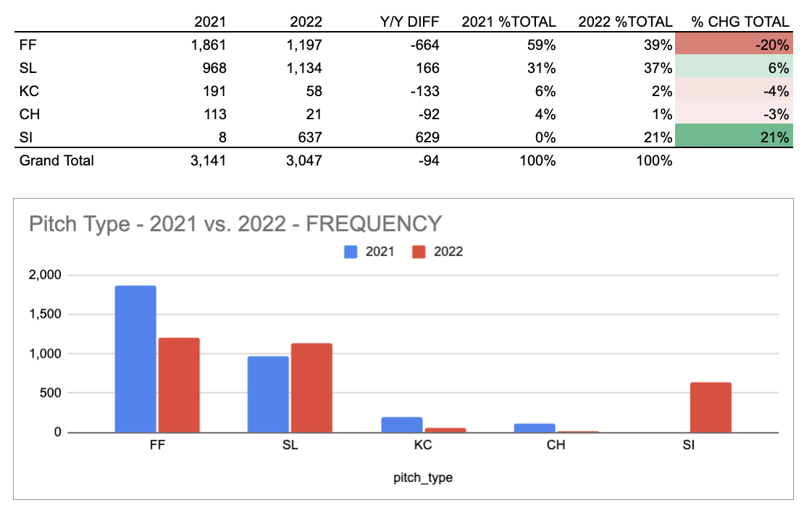
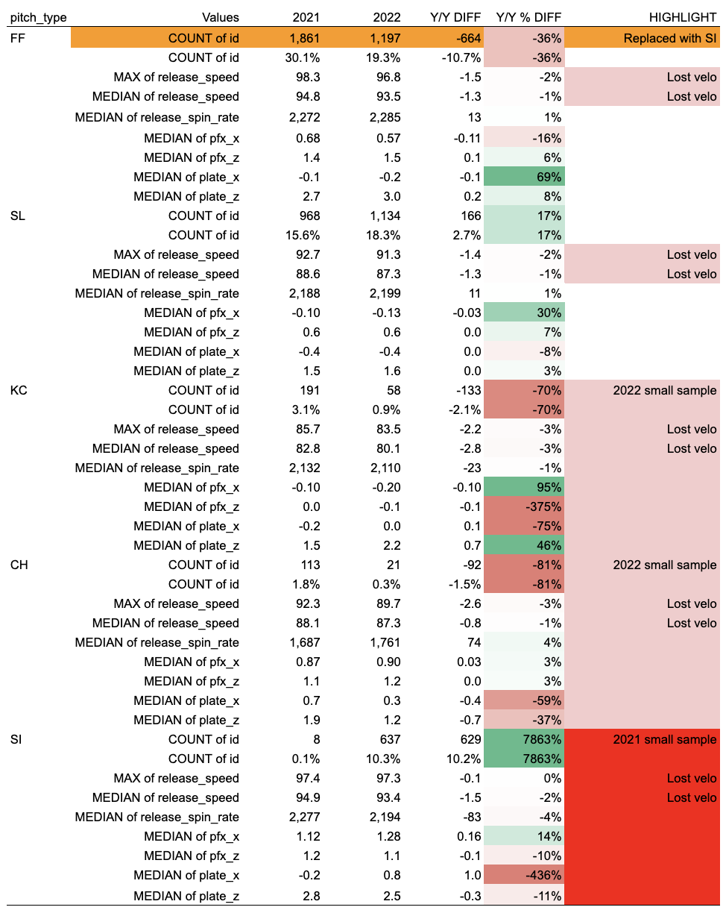

POST-CODING CHALLENGE: LATER THAT DAY...
=
It's clear I approached this problem incorrectly, so I'll add some revisions that hopefully show some clearer thinking...
- The early questions are answerable using Google Sheets/Excel and that's where I should have done all of my sanity-checking.
- In my official submission, I forgot to filter by the type of game, but I'll proceed assuming I'm only concerned with regular season pitches (although I should have asked this as a clarifying question)
- With essentially the same number of pitches thrown in 2021 vs. 2022, the data show that Robbie Ray replaced a lot of four-seam fastballs with sinkers.

- I originally attempted to summarize the change in each metric using a box plot comparison, but this is probably too much information. I probably should have instead manually inspected the data and chosen a few metrics to highlight. 
- The table below shows the median for some crucial metrics for anyone interested in inspecting the data. 
- Big change: pitch mix from FF to SI.
- Another big change: Loss of velo across arsenal

CODING CHALLENGE: SUBMITTED SEP 8 11:30 AM PST
=
You can view my original submission here: https://github.com/brntsllvn/interview/tree/4670121f9ed245df42c9f2fbb12aa09482b082a5

